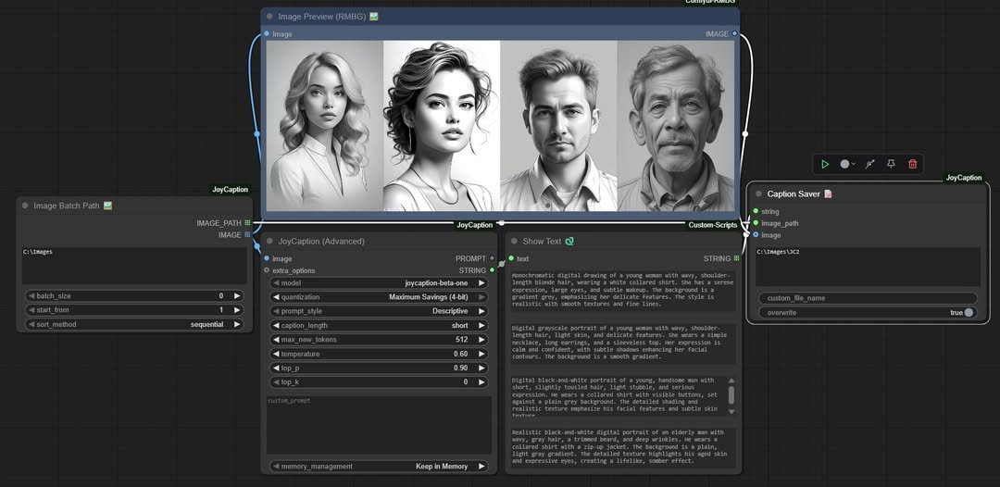

# ComfyUI-JoyCaption

Joy Caption is a ComfyUI custom node powered by the LLaVA model for efficient, stylized image captioning. Caption Tools nodes handle batch image processing and automatic separation of caption text.


## News & Updates
- **2025/06/07**: Update ComfyUI-RMBG to **v1.1.1** ( [update.md](https://github.com/1038lab/ComfyUI-JoyCaption/blob/main/update.md#v111-20250607) )


- **2025/06/05**: Update ComfyUI-RMBG to **v1.1.0** ( [update.md](https://github.com/1038lab/ComfyUI-JoyCaption/blob/main/update.md#v110-20250605) )

[](https://github.com/1038lab/ComfyUI-JoyCaption/blob/main/example_workflows/batch_image_text_output.json)

- Add Caption tools

## Features

- Simple and user-friendly interface
- Multiple caption types support
- Flexible length control
- Memory optimization options
- **Automatic model download** - the model will be downloaded automatically and properly renamed on first use
- Support for multiple caption types
- Support for advanced customization options
- Multiple precision options (fp32, bf16, fp16)

## Installation

1. Clone this repository to your `ComfyUI/custom_nodes` directory:
```bash
cd ComfyUI/custom_nodes
git clone https://github.com/1038lab/ComfyUI-JoyCaption.git
```

2. Install the required dependencies:
```bash
cd ComfyUI/custom_nodes/ComfyUI-JoyCaption
pip install -r requirements.txt
```

## Download Models
The models will be automatically downloaded and renamed on first use, or you can manually download them:
| Model | Link |
| ----- | ---- |
| JoyCaption Beta One | [Download](https://huggingface.co/fancyfeast/llama-joycaption-beta-one-hf-llava) |
| JoyCaption Alpha Two | [Download](https://huggingface.co/fancyfeast/llama-joycaption-alpha-two-hf-llava) |

After downloading, place the model files in your `ComfyUI/models/diffusion_models/JoyCaption` directory.

## Basic Usage

### Basic Node

1. Add the "JoyCaption" node from the `🧪AILab/📝JoyCaption` category
2. Connect an image source to the node
3. Select the model file (defaults to `llama-joycaption-beta-one-hf-llava`)
4. Adjust the parameters as needed
5. Run the workflow

### Advanced Node

1. Add the "JoyCaption (Advanced)" node from the `🧪AILab/📝JoyCaption` category
2. Connect an image source to the node
3. Select the caption type
4. Adjust the parameters as needed
5. Run the workflow

### Parameters

#### Basic Node

| Parameter | Description | Default | Range |
| --------- | ----------- | ------- | ----- |
| **Model** | The JoyCaption model to use | `llama-joycaption-beta-one-hf-llava` | - |
| **Memory Control** | Memory optimization settings | Default | Default (fp32), Balanced (8-bit), Maximum Savings (4-bit) |
| **Caption Type** | Caption style selection | Descriptive | Descriptive, Descriptive (Casual), Straightforward, Tags, Technical, Artistic |
| **Caption Length** | Output length control | medium | any, very short, short, medium, long, very long |


### Quantization Options

| Mode | Precision | Memory Usage | Speed | Quality | Recommended GPU |
|------|-----------|--------------|-------|---------|----------------|
| Default | fp32 | ~16GB | 1x | Best | 24GB+ |
| Default | bf16 | ~8GB | 1.5x | Excellent | 16GB+ |
| Default | fp16 | ~8GB | 2x | Very Good | 16GB+ |
| Balanced | 8-bit | ~4GB | 2.5x | Good | 12GB+ |
| Maximum Savings | 4-bit | ~2GB | 3x | Acceptable | 8GB+ |

#### Advanced Node

| Parameter | Description | Default | Range |
| --------- | ----------- | ------- | ----- |
| **Extra Options** | Additional feature options | [] | Multiple options |
| **Person Name** | Name for person descriptions | "" | Any text |
| **Max New Tokens** | Maximum tokens to generate | 512 | 1-2048 |
| **Temperature** | Generation temperature | 0.6 | 0.0-2.0 |
| **Top-p** | Sampling parameter | 0.9 | 0.0-1.0 |
| **Top-k** | Top-k sampling | 0 | 0-100 |
| **Precision** | Use fp32 for best quality, bf16 for balanced performance, fp16 for maximum speed. 8-bit and 4-bit quantization provide significant memory savings with minimal quality impact |

## Setting Tips

| Setting | Recommendation |
| ------- | -------------- |
| **Memory Mode** | Based on GPU VRAM: 24GB+ use Default, 12GB+ use Balanced, 8GB+ use Maximum Savings |
| **Input Resolution** | The model works best with images of 512x512 or higher resolution |
| **Memory Usage** | If you encounter memory issues, try using 4-bit mode or processing images at a lower resolution |
| **Performance** | For batch processing, consider reducing max_new_tokens for faster throughput |
| **Temperature** | Lower values (0.6-0.7) for more stable results, higher values (0.8-1.0) for more diverse results |

## About Model

This implementation uses LLaVA-based image captioning models, optimized to provide fast and accurate image descriptions.

Model features:
* Free and open weights
* Uncensored content coverage
* Broad style diversity (digital art, photoreal, anime, etc.)
* Fast processing with bfloat16 precision
* High-quality caption generation
* Memory-efficient operation
* Consistent results across various image types
* Support for multiple caption styles
* Optimized for training diffusion models

The models are trained on diverse datasets, ensuring:
* Balanced representation across different image types
* High accuracy in various scenarios
* Robust performance with complex scenes
* Support for both SFW and NSFW content
* Equal coverage of different styles and concepts

## Roadmap

Future plans include:
* Support for more caption types
* Additional optimization options
* Improved memory management
* Batch processing support

## Credits

* JoyCaption Model: [fancyfeast](https://huggingface.co/fancyfeast)
* Created by: [1038lab](https://github.com/1038lab)

## License

This repository's code is released under the GPL-3.0 License.
